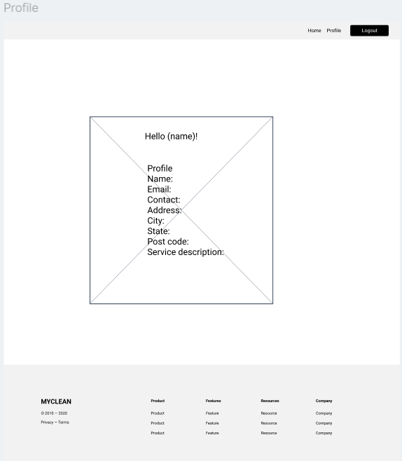
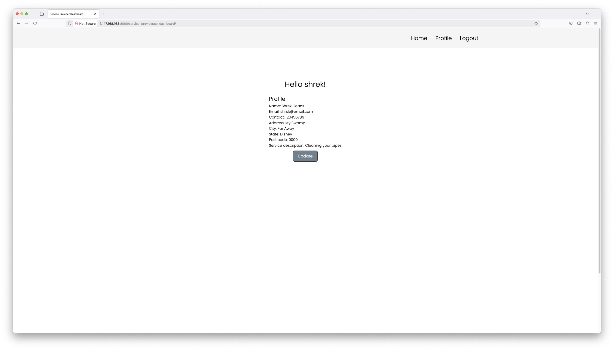

# Service provider register
As a service provider I need to be able to logout of my account after registering/logging in.

## Priority: 10

## Estimation: 1 day
~ 5 hours with our budget.

## Assumptions:
- Simple link routing will be used

## Description:
The service provider should be able to login to their account.

## Tasks:
- Add simple logout functionality.
- Add documentations.
- Unit testing.
- Implement html designs.

## In progress:

# UI Design:
## UI Design is a simple button in the nav.

# Completed:
- Add simple logout functionality.
    - Josh
- Add documentations.
    - Josh
- Unit testing.
    - Josh
- Implement html designs.
    - Josh

# Screenshot(s):
## A logout link that shows when a user is logged in.

# Project Links:
- [Iteration 1](../iteration_1.md)
- [Main Project](../../README.md)
