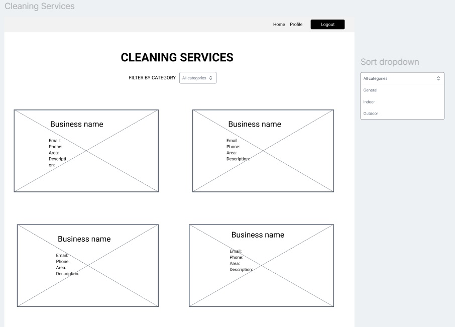
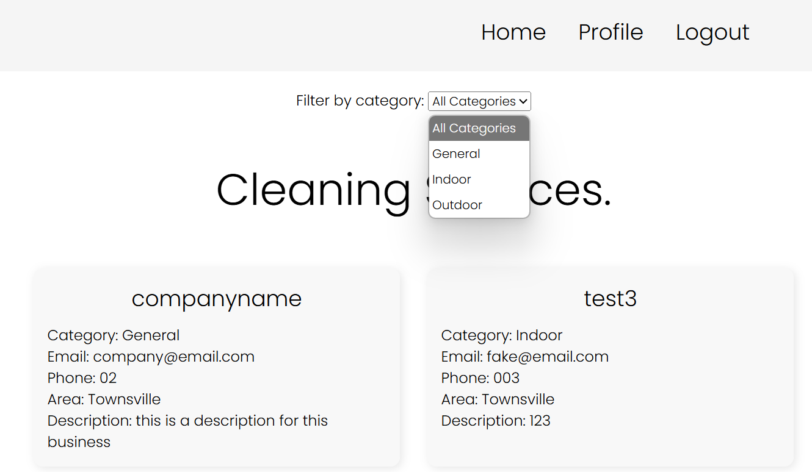

# Client filter by category
As a client, I need to be able to filter services by category so I can find relevant options faster.

## Priority: 10

## Estimation: 3 days
~ 15 hours with our budget.

## Assumptions:
- Cleaning services posted on the website will include metadata, which will be used for identifying which services do/do not apply to the filter.
- The required fields of a service (in order to filter them) will be filled out correctly.
- Clients will alter the filter settings multiple times.
- The services will be able to be grouped into a relatively small number of categories.

## Description:
The client should be able to filter by categories so they can find their desired cleaning service.

## Tasks:
- Decide categories for filter.
- Implement categories for service providers to list their services as.
- Add filter functionality on service listings page, with ability to change and clear the filter options.
- Add documentations.
- Unit testing.
- Implement html design for filter.

## In progress:

# UI Design:
## 

# Completed:
- Decide categories for filter.
    - Josh
- Implement categories for service providers to list their services as.
    - Josh
- Add filter functionality on service listings page, with ability to change and clear the filter options.
    - Josh
- Add documentations.
    - Josh  
- Unit testing.
    - Josh
- Implement html design for filter.
    - Josh

# Screenshot(s):
## 

## Wireframe for search filters.

# Project Links:
- 
