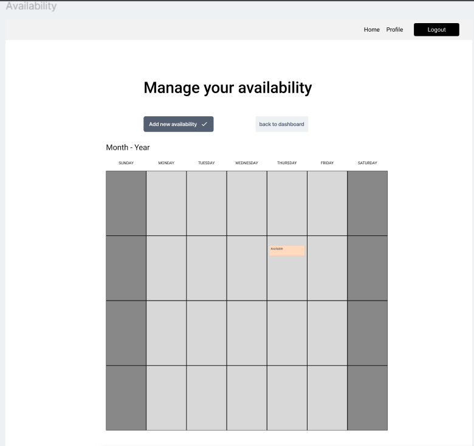
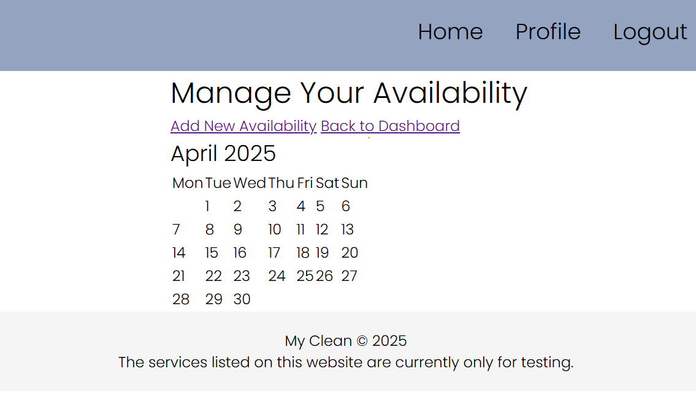

# Service provider schedule
As a service provider, I need to be able to view and list my availability on a schedule so clients know when I am free.

## Priority: 20

## Estimation: 5 days
~ 25 hours with our budget.

## Assumptions:
- The service provider will need to update their availability.

## Description:
The service provider should be able to view and update their availability on the schedule, which will be reflected on the listing for that service.

## Tasks:
- Create Availability model.
- Create form.
- Display in sp dashboard.
- Add documentations.
- Do unit testing.
- Implement html designs.

## In progress:

# UI Design:
## The Design is a simple calendar.

# Completed:
- Create Availability model.
    - Jack
    - Josh
- Create form.
    - Jack
    - Josh
- Display in sp dashboard.
    - Jack
    - Josh
- Do unit testing.
    - Josh
- Add css styling to form.
    - Callum

# Screenshot(s):
## A calendar with the option to add availibity slots on chosen dates.

# Project Links:
- [Iteration 1](../iteration_2.md)
- [Main Project](../../README.md) 
