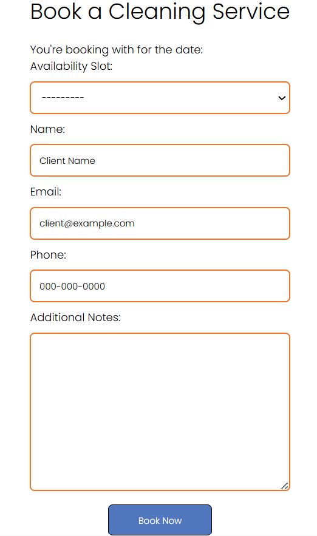

# Client book a service
As a client, I need to be able to book a cleaning service so I can schedule an appointment.

## Priority: 25

## Estimation: 2 days
~ 10 hours with our budget.

## Assumptions:
- The form will not go through unless the required fields are filled out.
- A button on the service listing will take the client to the booking form.
- All services will use the same booking form.

## Description:
The client should be able to complete a booking form from a service's listing, which will then be sent to the service provider.

## Tasks:
- Create booking form.
- Add buttons on service listings to access form.
- Add error checking for incorrect or incomplete sections of form.
- Implement functionality to send completed forms to service provider.
- Add documentations.
- Do unit testing.
- Implement html design for form.

## In progress:
- Implement html design for form.

# UI Design:
## The Design is a simple booking form.

# Completed:
- Create booking form. (Reece)
- Add buttons on service listings to access form. (Reece)
- Add error checking for incorrect or incomplete sections of form. (Reece)
- Implement functionality to send completed forms to service provider. (Reece)
- Add documentations. (Reece)
- Do unit testing. (Reece)
- Add css design to booking form. (Callum)

# Screenshot(s):
## A form for clients to book an available time slot from a business

# Project Links:
- [Iteration 2](../iteration_2.md)
- [Main Project](../../README.md)
