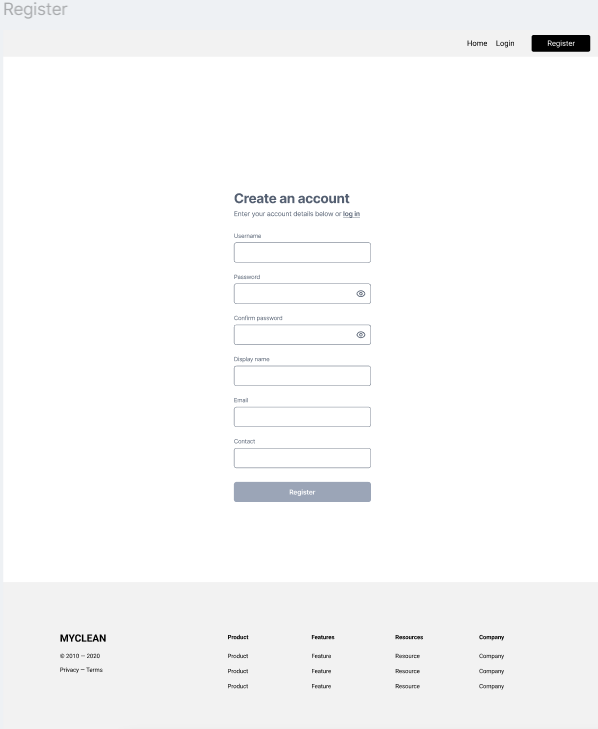

# Service provider register
As a service provider I need to be able to register my service/s so a potential client can find us.

## Priority: 10

## Estimation: 1 day
~ 5 hours with our budget.

## Assumptions:
- The service provider will register using an email andpassword.
- Basic profile details (e.g., business name and contact number) will be required.
- Password must meet security standards (e.g., minimum 8characters, including a number and special character).
- Django’s built-in authentication system will be used 

## Description:
The service provider should be able to register for an account by providing essential information.

## Tasks:
- Define a ServiceProvider model.
- Add a register functionality using ServiceProvider model.
- Add documentations.
- Unit testing.
- Implement html designs.

## In progress:

# UI Design:
## Wireframe for the register page.

# Completed:
- Define a ServiceProvider model.
    - Josh
- Add a register functionality using ServiceProvider model.
    - Josh
- Add initial documentations.
    - Josh
- Unit testing.
    - Josh

# Screenshot(s):
## Iteration 1 of register page.

# Project Links:
- [Iteration 1](../iteration_1.md)
- [Main Project](../../README.md)
