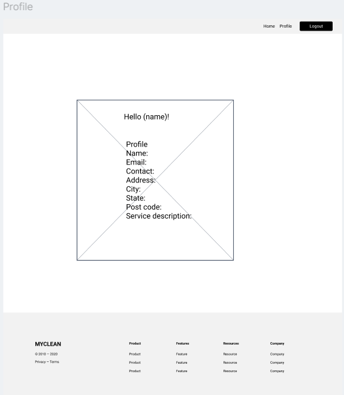

# Create service provider profile
As a service provider I need to be able to add to my profile such as my general location and service description.

## Priority: 10

## Estimation: 2 days
~ 10 hours with our budget.

## Assumptions:
- Service provider model will be used.
- Profile details such as city, state, postcode and description are the basic information needed.

## Description:
The service provider should be able to add additional details about their service after registration of their account.

## Tasks:
- Create form for service information.
- Create template routing to additional information endpoint.
- Update sp_dashboard to display updated information.
- Add documentations.
- Unit testing.
- Implement html designs.

## In progress:

# UI Design:

# Completed:
- Create form for service information.
    - Josh
- Create template routing to additional information endpoint.
    - Josh
- Update sp_dashboard to display updated information.
    - Josh
- Add documentations.
    - Josh
- Unit testing.
    - Josh
- Implement html designs.
    - Josh    

# Screenshot(s):
- Iteration 1 Service provider profile page.

# Project Links:
- [Iteration 1](../iteration_1.md)
- [Main Project](../../README.md)
