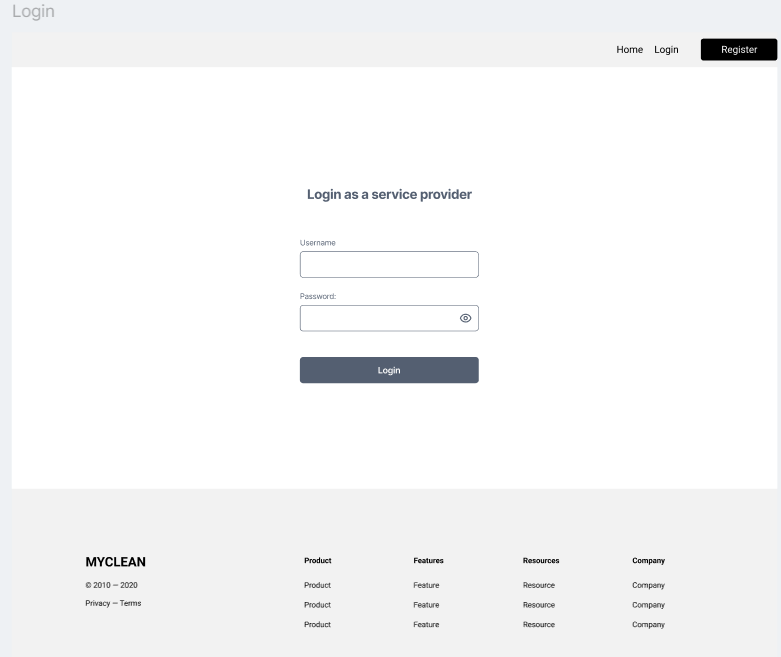
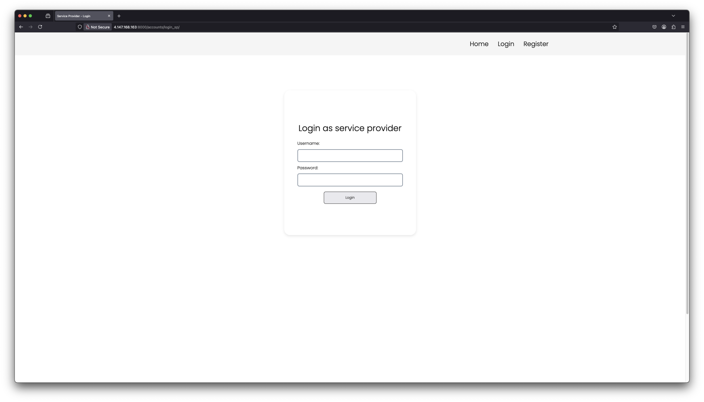

# Service provider register
As a service provider I need to be able to login to my account after registering.

## Priority: 10

## Estimation: 1 day
~ 5 hours with our budget.

## Assumptions:
- Basic profile details will be required ('username' and 'password).
- Password must meet security standards (e.g., minimum 8characters, including a number and special character).
- Django’s built-in authentication system will be used 

## Description:
The service provider should be able to login to their account.

## Tasks:
- Add simple login functionality.
- Add documentations.
- Unit testing.
- Implement html designs.

## In progress:

# UI Design:

# Completed:
- Add simple login functionality.
    - Callum
- Add documentations.
    - Callum
- Unit testing.
    - Josh
- Implement html designs.
    - Callum

# Screenshot(s):
- Iteration 1 login page.

# Project Links:
- [Iteration 1](../iteration_1.md)
- [Main Project](../../README.md)
